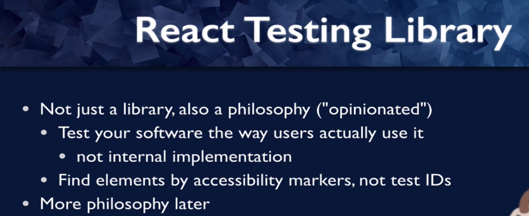
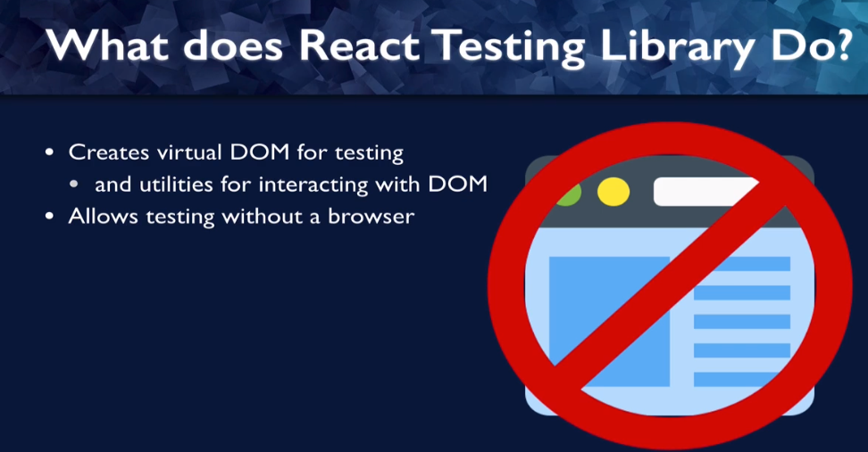

# React Testing Library

1. React testing library is a library, of course, but it also has a strong philosophy behind it.
2. It is what we call opinionated, which means the way the library is written encourages a certain set
   of practices and in this case, that's the best practices for testing react.
3. One is to test your software the way that users actually use it.
4. This is instead of testing internal implementation and by internal implementation, I mean how your
   software is written.
5. What you really care about is whether or not the software works the way it's supposed to.
6. How the code is written can change, and as long as the software is still behaving according to the
   specifications, then the tests will still pass.
7. Another opinionated part of testing library is to find your elements by accessibility markers, that is,
   by the way screen readers and other assistive technologies would find your elements instead of using test ideas.
   This probably sounds obvious, but if your tests can find your elements by these accessibility markers,
   then so can screen readers.And it means that your software is accessible.

# React Testing Library vs jest

React Testing Library provides a virtual dom for tests, any time you're running tests without a browser,
you need to have a virtual dom so that you can do things like click elements.
And you can also check to see whether the virtual dom is behaving as you would hope.

Jest on the other hand, is a test runner, so jest is responsible for finding tests, running the tests
and determining whether the tests pass or fail.

