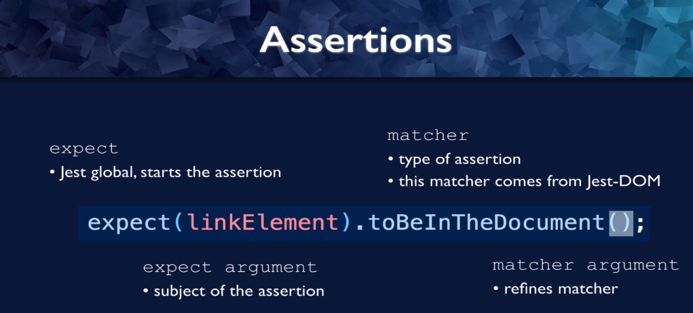
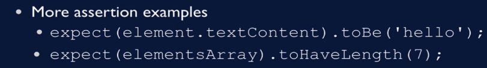
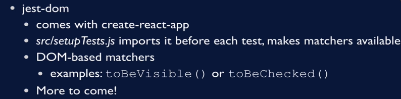

# Assertion

1. These assertions are what determine whether the test passes or fails.
   Let's break down the pieces of an assertion here.

2. They all start with the expected method, which is a global in jest.
3. Then there's an argument, this is what your assertion is asserting against, this is what jest will examine
   to see if it meets our expectations.
4. After that, we are going to use some sort of matcher, this is what the assertion type is.
   The matcher in this case `toBeInTheDocument` comes from Jest Dom.
5. And then sometimes there's an argument to the matcher,`toBeInTheDocument` this matcher doesn't happen
   to have an argument, basically, either the element is in the document or it's not in the document.
   But sometimes you're comparing the element to some sort of known quantity, and that's where you would see the argument here.

---

## More assertion examples

---

# jest dom

1. jest-dom comes with Create
   React app, that is, it's installed by default with Create React app.

2. And it uses this `setupTests.js` file to import jest-dom before each test.

3. All that means is that the jest matchers are available for every test.

4. So we saw a jest matcher above, which was `toBeInTheDocument`.
   Basically, these are dom based matchers, the matchers that you see above in the assertion examples
   `toBe` and `toHaveLength`, those are very general.
   They could apply to any node code.
   Dom based matchers, are matchers like `toBeInTheDocument` that really apply only to a virtual Dom.

5. Other ones are `toBeVisible`, `toBeChecked` like a check box.

