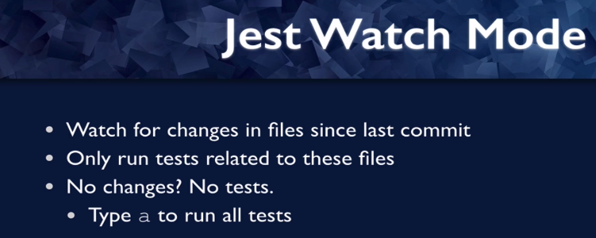

# Jest

1. React testing library, helps with rendering components into the
   virtual dorm.
   We saw that with the render method.

2. It also helps with searching the virtual dom, we saw that `getByText` method in the tests that came with Create React app.

3. But we will shortly is interacting with the virtual dom, clicking on elements or entering text. So that's what react testing library is.

4. Therefore, however, it needs a test runner. It needs something that will find tests that will run them and will make assertions.
   And that's where Jest comes in.

5. Jest is not the only test runner, there's Moka and then there's Jasmine, but jest as recommended by testing library, it also comes with Create React app.

---

## Jest watch mode

Watch mode is a way that you can run jest so that it will watch for any changes in files since the last commit and it will only run tests that are related to files that have changed since the last commit.

---

## How does jest work?

1. There is a global test method that has two arguments, the first argument is a string description of the test and jest uses this argument so that It can tell you when a test fails, which test actually fails?
   Because usually you're running more than one test.
   The second argument is a test function and jest runs that function to determine whether your test succeeds or fails.
2. How does it do that?
   Your test fails if any error is thrown while it's running that test function.
   The way assertions work is that they throw errors when your expectation fails.
   So if there's no error in the test function, then your test passes.
   So an empty test should pass.

3. you usually don't throw errors deliberately in tests to make them fail.
   Usually you run assertions, but the assertions job is to throw an error if your expectation fails, and that will fail the test.
