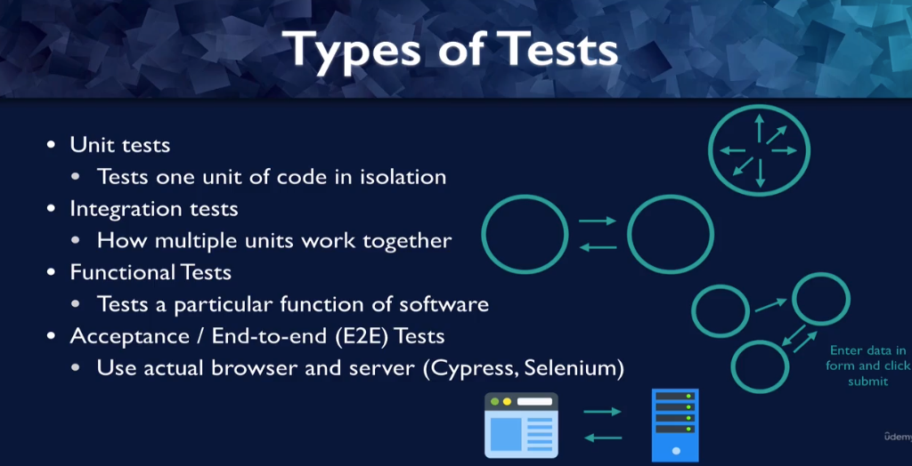

# Types of tests

we'll talk about how react testing library fits in with these types of tests.

1. The first type of tests are unit test, so this tests one unit of code, which is often a function or a react component in isolation.
   You don't want to test any interactions of this unit with any other units of code.

2. Integration tests, tests how multiple units work together, so that actually tests the interaction between units, so the interaction between components or the interaction between different micro services for example.

3. Functional tests are testing a particular function of the software. And it's a bit of an issue in English that function can mean a unit of your software that takes inputs and gives outputs and it can also mean behavior. And in this case, I'm talking about behavior, general behavior of your software and not one particular code function.

   - So what does that mean, maybe you're entering data into a form and clicking submit and the function that you're checking is that the software does the right thing with that particular set of data.

   - That might be an integration test that might have multiple units, but you also might have a functional test that's just a unit test maybe is just testing to see whether when you enter invalid data entry box turns red.Right. That would be more of a unit test, but it's still a functional test.

   - The idea here, though, for functional tests is that you really you're not testing your code, you're testing behavior.

   - And that distinction might sound familiar from the first lecture where I where I talked about how react testing library encourages testing how users use your software and not testing your internal code implementation.

   So it probably won't surprise you to learn that react testing library encourages functional tests.

4. Finally, there are acceptance or end to end tests, which you sometimes see written as E to E. These tests require an actual browser and they also require the server that your app is connected to. So these require a special tool, usually Cyprus or selenium. And this is not the type of test that reacts to testing libraries built for.
