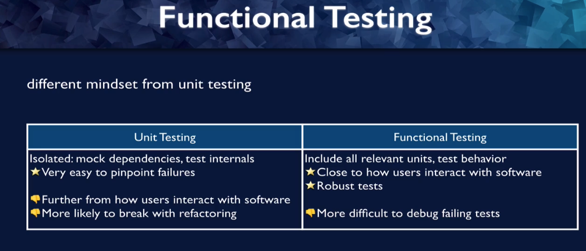

# Functional testing vs Unit testing

1. For unit testing, you want your tests to be as isolated as possible, so when you're testing a function or a component, you mark your dependencies. And by that I mean if there are other dependencies, other functions that the component is relying on,
   you use test versions of that instead of the actual version so that, you know, if there's a problem, if the tests fail, that it is your particular unit that is causing the tests to fail and not anything else in the ecosystem. It makes it very, very isolated.

2. You also test internals. You need to do this because if you're testing a component in isolation, sometimes all you can do is
   test the state, test differences that it made to the state because you don't have the other components to see what difference it made to your app.

3. When it's isolated, it is very easy to pinpoint failures because your tests are isolated to one unit of code, you know exactly where to look when your tests are failing.

4. However, it's further from how users are interacting with your software, which means that you could have tests passing. Even though users interacting with your software would have failures or conversely, you could have your tests fail, even though users would have no problem interacting with your software, it's less
   tightly coupled to how users interact with your software.

5. It's also more likely to break with refactoring, refactoring means changing how your software is written without changing the behavior.

6. With unit testing, you are often testing how your software is written. You're testing your internals, and that means that if you change how it's written, your tests might fail, even though the behavior hasn't changed.

7. So this is a negative, because if your software is still working as it's supposed to do, you'd want your tests to still pass.

8. So functional testing is a just a different mindset here, you're going to include all relevant units for a particular behavior or user flow that you're testing.

9. The benefits are that this is close to how users interact with the software, that means that it's much more likely that passing tests means that users are going to be OK and failing tests means that users would have problems.

10. It also means that your tests are robust, it means that if you refactor how your code is written, as long as the behavior stays the same, your test should still pass.

11. The downside is it is more difficult to debug failing tests here, your tests are not tightly coupled with the code, so it's not obvious which parts of your code are causing the tests to fail.

12. On the whole, React testing library believes that the advantages of functional testing outweigh the disadvantages.
